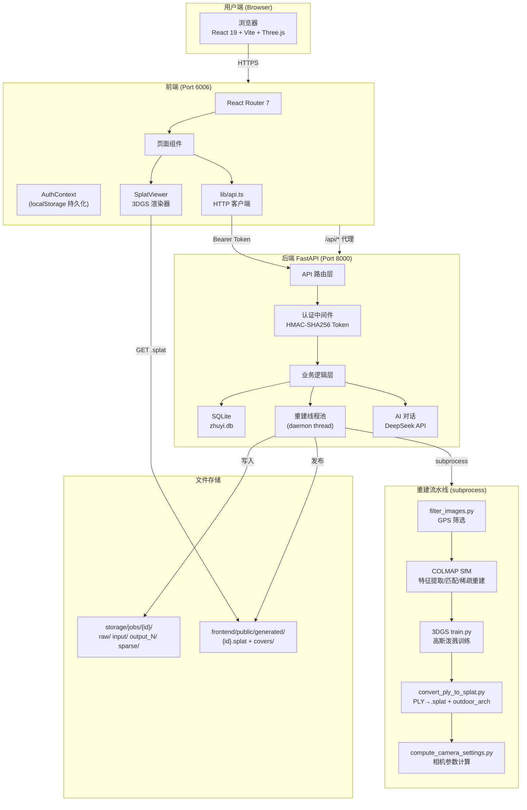
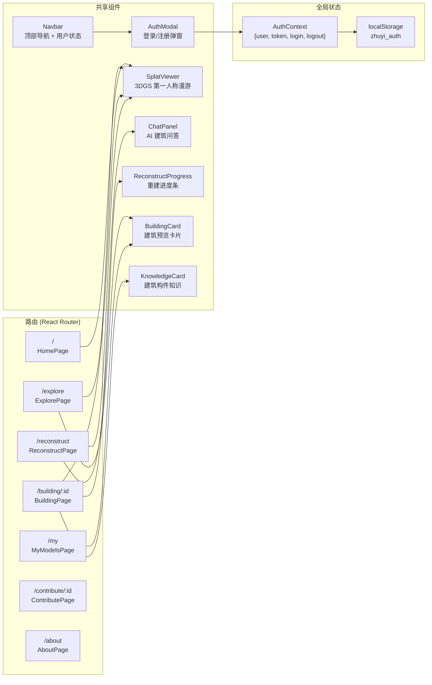
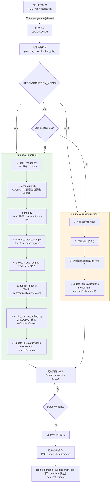
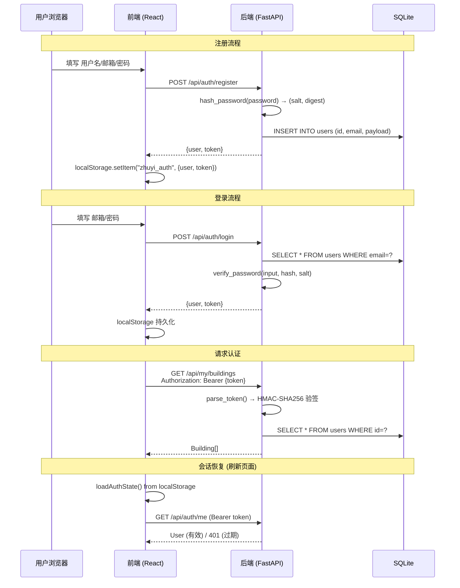
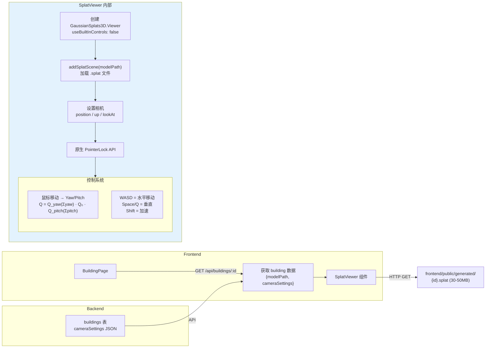
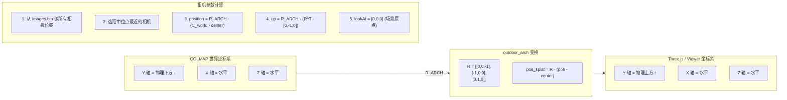
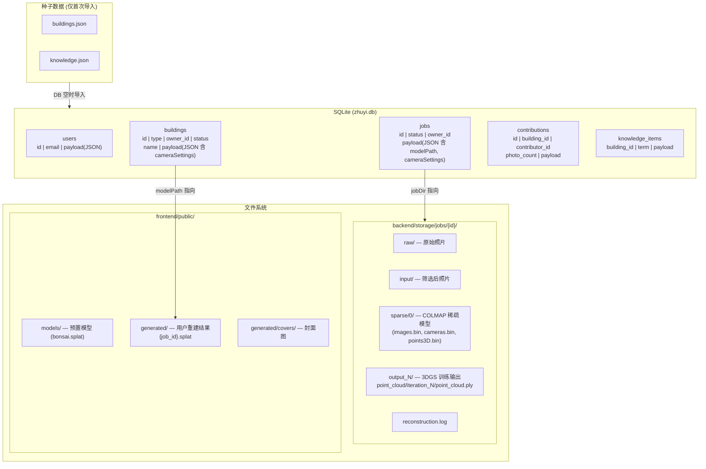

# 筑忆 (Zhuyi) — 系统架构原理图

## 1. 系统总览



## 2. 页面路由与组件关系



## 3. 后端 API 全景

```mermaid
graph TB
    subgraph Public["公开接口"]
        Health["GET /api/health"]
        Overview["GET /api/overview"]
        ListBuildings["GET /api/buildings"]
        GetBuilding["GET /api/buildings/:id"]
        GetKnowledge["GET /api/buildings/:id/knowledge"]
    end

    subgraph AuthEndpoints["认证接口"]
        Register["POST /api/auth/register"]
        RegisterAdmin["POST /api/auth/register-admin<br/>(需 adminCode)"]
        Login["POST /api/auth/login"]
        Me["GET /api/auth/me"]
    end

    subgraph Protected["需登录接口"]
        MyBuildings["GET /api/my/buildings"]
        StartRecon["POST /api/reconstruct<br/>(上传照片)"]
        PollJob["GET /api/reconstruct/:job_id"]
        SaveJob["POST /api/reconstruct/:job_id/save"]
        ChatAPI["POST /api/chat"]
        Contribute["POST /api/contribute/:id"]
    end

    subgraph Admin["管理员接口"]
        CreateProject["POST /api/admin/projects"]
        DeleteProject["DELETE /api/admin/projects/:id"]
        ImportModel["POST /api/admin/import-model"]
    end

    subgraph DB["SQLite Tables"]
        Users["users<br/>(id, email, payload)"]
        Buildings["buildings<br/>(id, type, owner_id, status, payload)"]
        Jobs["jobs<br/>(id, status, owner_id, payload)"]
        Contributions["contributions<br/>(id, building_id, contributor_id, payload)"]
        Knowledge["knowledge_items<br/>(building_id, term, payload)"]
    end

    Register --> Users
    Login --> Users
    ListBuildings --> Buildings
    StartRecon --> Jobs
    SaveJob --> Buildings
    Contribute --> Contributions
    GetKnowledge --> Knowledge
    ChatAPI -->|DeepSeek/本地回退| Buildings
```



## 4. 重建流水线（核心流程）



## 5. 认证流程



## 6. 3DGS 查看器数据流



## 7. 坐标系变换原理



## 8. 数据存储全景



## 9. 技术栈一览

| 层级 | 技术 | 用途 |
|------|------|------|
| **前端框架** | React 19 + TypeScript | SPA 应用 |
| **构建工具** | Vite 8 | 开发服务器 + 打包 |
| **样式** | Tailwind CSS 4.2 | 原子化 CSS |
| **动画** | Framer Motion 12 | 页面过渡动画 |
| **路由** | React Router 7 | 客户端路由 |
| **3D 渲染** | Three.js 0.183 | WebGL 抽象层 |
| **3DGS 库** | @mkkellogg/gaussian-splats-3d 0.4 | .splat 加载与渲染 |
| **后端框架** | FastAPI 0.116 | REST API |
| **运行时** | Uvicorn 0.35 | ASGI 服务器 |
| **数据库** | SQLite 3 | 持久化存储 |
| **数据校验** | Pydantic v2 | 模型校验 |
| **AI 对话** | DeepSeek API | 建筑知识问答 |
| **SfM** | COLMAP | 多视图几何重建 |
| **3D 重建** | 3D Gaussian Splatting | 辐射场训练 |
| **图像处理** | Pillow + NumPy | 封面生成、点云处理 |
| **部署** | AutoDL (RTX 4080 SUPER) | GPU 服务器 |

## 10. 端口与部署

```
AutoDL 服务器
├── Port 6006 → 前端 Vite 开发服务器 → 公网 HTTPS (AutoDL 映射)
├── Port 8000 → 后端 FastAPI (仅内网，由 Vite 代理 /api/*)
└── Port 6008 → 备用端口 → 公网 HTTPS (AutoDL 映射)

Vite 代理规则: /api/* → http://localhost:8000/api/*
前端直接服务: /generated/*.splat, /models/*.splat (静态文件)
```
