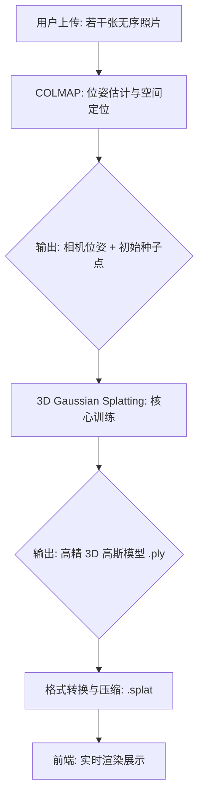

# 筑忆 (Zhu Yi) —— 技术实现全景梳理

> **🚀 快速预览 (Quick Start)**
> 
> 若需查看当前前端页面及 3D 模型渲染效果，请在终端执行以下命令：
> ```bash
> cd frontend
> npm install  # 仅首次运行需要
> npm run dev
> ```


---

## 1. 竞品分析与痛点切入 (Competitive Analysis)

目前的 3D 重建赛道主要分为“专业级”和“大众消费级”两个极端，但都无法有效解决大规模、低门槛的濒危古建筑数字保护问题。

### 1.1 专业赛道（以大疆 DJI 为代表）
*   **核心痛点**：
    *   **高成本**：单套无人机+激光雷达设备数万元起，且需配备高性能图形工作站。
    *   **高门槛**：需要具备专业资质的飞手进行外业拍摄，后期需人工参与建模干预。
    *   **低覆盖率**：主要针对国家级文保单位，对于散落在乡间、面临消亡的 76 万处非定级文物，专业团队无法覆盖。

### 1.2 大众赛道（以 Scaniverse 为代表）
*   **核心痛点**：
    *   **画质瓶颈**：受限于移动端即时算力，Scaniverse 在复杂古建筑（如斗拱、榫卯细节）上的重建效果不尽如人意，极易出现模型“糊成一团”的情况。
    *   **无法重建身边建筑**：对于遮挡严重的乡村祠堂、结构复杂的民居，单人手持手机拍摄难以获得完整模型。
    *   **孤岛数据**：属于“单机游戏”，用户拍完即存，无法通过众包协作将多人的照片合并成一个精细的大场景模型。

### 1.3 我们的核心定位：筑忆 (Zhu Yi)
通过 **“云端 3DGS 算法 + 全民众包协作”**，填补大众低门槛拍摄与专业级高精画质之间的空白。

---

## 2. 核心优势对比表 (The Edge)

| 维度 | 专业测绘 (大疆) | 大众APP (Scaniverse) | **筑忆 (Zhu Yi)** |
| :--- | :--- | :--- | :--- |
| **设备成本** | 数万元设备 + 专人维护 | 手机 (需 LiDAR 硬件最佳) | **普通手机即可 (无硬件依赖)** |
| **重建精度** | 毫米级，但缺乏真实感 | 厘米级，精细纹理丢失严重 | **亚像素级细节，照片级质感** |
| **协作模式** | 单一项目，无法群众参与 | 个人作品展示，无协作 | **众包模式，数据聚合涌现** |
| **场景支持** | 适合开阔大场景 | 适合室内、小物件 | **适合复杂木构、半遮挡古建** |
| **主要定位** | 国家级文保单位 | 个人 3D 纪念分享 | **全民参与的数字抢救平台** |

---

## 3. 前端展示层：高性能 Web 交互 (Frontend)

前端不仅是用户的操作界面，更是 3D 成果的最终呈现载体。

### 3.1 功能矩阵
| 模块 | 功能描述 | 核心价值 |
| :--- | :--- | :--- |
| **3D 漫游** | 支持 360° 旋转、平滑缩放、第一人称视角切换 | 提供沉浸式古建筑考察体验 |
| **众包地图** | 集成天地图，可视化展示全国古建筑分布 | 聚合碎片化数据，形成数字保护合力 |
| **重建中心** | 照片拖拽上传、进度实时监控、历史记录管理 | 实现 3D 重建流程的“零门槛”闭环 |
| **双模式切换** | 个人私有模型 vs 公共众包项目 | 兼顾个人数据隐私与集体文化贡献 |

### 3.2 核心技术：Web 实时 3DGS 渲染
*   **技术架构**：采用 **`@mkkellogg/gaussian-splats-3d`** 库，其底层构建在 **Three.js** 这一成熟的 3D 渲染引擎之上。
*   **实现原理**：
    *   **输入**：经过算法层训练并压缩的 `.splat` 格式文件。该格式由库专门优化，包含数百万个高斯分布粒子的几何与外观参数。
    *   **处理机制**：利用库内置的 **Splatting 渲染管线**，将 3D 高斯粒子动态投影到屏幕。底层通过 **Custom Shader (自定义着色器)** 实现亚像素级的高质量混合渲染。
    *   **难点解决**：传统的 Mesh 模型在展现斗拱等精细结构时需要极高面数，导致网页卡顿且边缘走样。该渲染库通过**瓦片级排序 (Tile-based Sorting)** 和 **场景渐进加载 (Gradual Reveal Mode)** 机制，在确保 60FPS 实时渲染的同时，实现了从模糊到清晰的无缝视觉过渡。
*   **输出**：照片级的动态交互场景，支持亚像素级细节还原，且具备极高的兼容性（支持所有支持 WebGL 2.0 的现代浏览器）。

---

## 4. 算法核心层：全自动重建管线 (Algorithm)

本项目的 3D 重建核心算法基于 SIGGRAPH 2023 的 SOTA（最先进）研究成果。
> **参考论文**：[3D Gaussian Splatting for Real-Time Radiance Field Rendering (Kerbl et al., 2023)](https://repo-sam.inria.fr/fungraph/3d-gaussian-splatting/3d_gaussian_splatting_high.pdf)
> **项目主页**：[https://github.com/graphdeco-inria/gaussian-splatting](https://github.com/graphdeco-inria/gaussian-splatting)

### 4.1 技术流程图


### 4.2 步骤详解
1.  **位姿估计 (COLMAP - SfM)**：
    *   **解决问题**：普通照片只有像素信息，缺乏空间位置坐标。
    *   **核心输出**：**相机位姿 (Camera Poses)** 与 **相机内参 (Intrinsics)**。
    *   **算法细节**：通过 SIFT 特征匹配建立照片间的几何关联。利用运动恢复结构 (SfM) 算法，自动计算每张照片在三维空间中的精确坐标和朝向（位姿），作为重建的地理基准。
    *   **辅助输出**：稀疏点云（仅作为 3DGS 训练的初始种子点）。

2.  **3D 重建核心阶段 (3DGS Pipeline)**：
    详尽算法细节请参阅上述原论文，核心流程如下：
    *   **各向异性协方差表示**：将每个点表示为一个 3D 高斯球，通过协方差矩阵定义其形状和方向（各项异性）。相比传统点云，这种表示法能通过重叠的椭球体更好地模拟连续表面和精细纹理。
    *   **球谐函数 (Spherical Harmonics, SH)**：为每个高斯粒子分配高阶球谐系数，用于描述其在不同观察角度下的颜色变化。这使得模型能完美还原古建筑表面的视角相关外观（如琉璃瓦的金属反光、不同光照下的木材质感）。
    *   **高速差分渲染 (Differentiable Rasterization)**：采用一种极快的、基于瓦片（Tile-based）的投影光栅化技术。将 3D 粒子投影到 2D 屏幕，并维持渲染管线的可微性，从而允许通过梯度下降优化所有参数。
    *   **自适应密度控制 (Adaptive Density Control)**：这是保持模型高质量的关键。系统在训练中会自动识别“重建不足”（细节模糊）或“过度重建”（伪影）的区域，动态进行粒子分裂（Split）或克隆（Clone），或删除透明度过低的无效粒子，从而在保证渲染效率的同时最大化还原斗拱、雕刻等复杂古建细节。

### 4.3 核心原理解析：如何实现“照片级”还原
为了让非专业人员理解 3DGS 的优越性，可以从以下四个层面进行解读：

*   **从“硬边缘”到“柔和融合”**：传统的 3D 建模通常使用坚硬的点、线、面（积木式拼接），这在处理古建筑细微的纹理和复杂构件时容易产生锯齿感。3DGS 则采用了数百万个具有特定形状且边缘透明的“高斯粒子”。这些粒子在空间中相互交叠、平滑融合，能够像喷漆一样精准还原古建筑表面的细腻质感。
*   **记录“会转弯”的光影细节**：普通 3D 模型在不同角度看颜色是固定的。而 3DGS 为每个粒子记录了复杂的颜色信息，使其能够根据观察者的位置动态调整显示的颜色和亮度。这意味着琉璃瓦在阳光下的闪烁感、木材表面的漫反射等光影细节都能被完美捕捉并实时还原。
*   **基于“真题比对”的 AI 训练**：在重建过程中，算法会将当前生成的 3D 场景从各个角度“拍成照片”，并与用户上传的真实照片进行像素级的比对。如果发现不一致，AI 会自动微调相应区域粒子的位置、透明度和颜色。经过数千次的循环比对和修正，最终生成的 3D 模型在任何角度看都与真实照片高度吻合。
*   **复杂区域的“自动加密”机制**：古建筑的斗拱、雕刻等部位结构极度复杂。3DGS 系统具备自适应能力，它能自动识别这些细节不足的区域，并在该处生成更多的粒子进行填充。这种“哪里复杂补哪里”的机制，确保了系统既能兼顾整体渲染速度，又能精准保留古建筑最核心的艺术细节。

---

## 5. 后端调度层 (Backend)

[此部分暂由其他队友补充，主要涉及：分布式训练队列管理、用户鉴权、云端存储与数据持久化等内容。]

